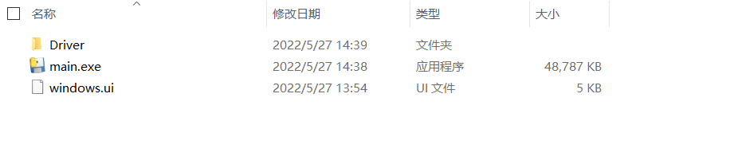
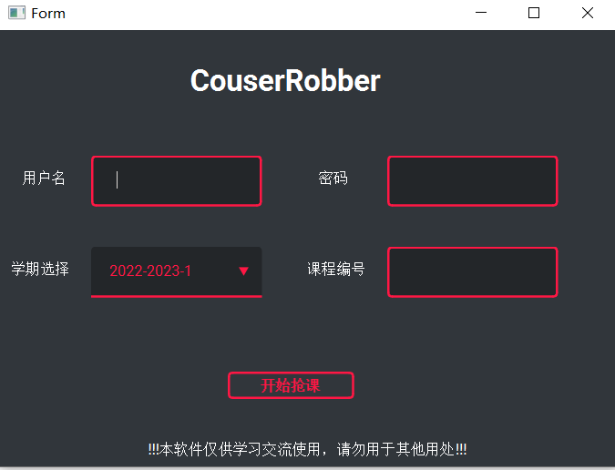
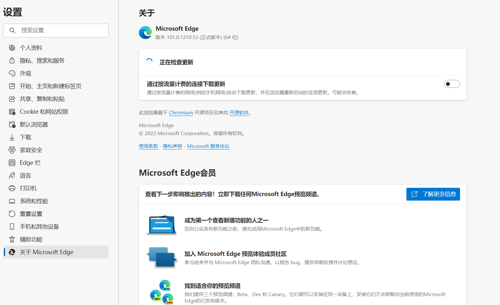

# CourseRobber-四川农业大学抢课脚本🙋

⚠️此项目仅供学习使用，请勿用于商业用途

⚠️具体抢课结果和所处网络环境相关，抢课失败的可能性依然存在，请谨慎使用

## 使用方法📖
### 使用发行版本（推荐）✨
从release处下载发布的最新版本，解压，文件夹如下

双击main.exe打开，进入抢课界面

根据自己的信息进行输入，并选定课程编号，点击抢课即可获得你心仪的课程。

注意：本项目的自动化过程基于Eege浏览器，版本为101.0，一般使用Windows均会预装，你可以如下进行确认
1. 打开Eege并进入设置
2. 点击关于Microsoft Edge
3. 查看版本号

### 使用源码🐍
clone本项目到电脑，使用`pip install -r requirements.txt`安装依赖, 并运行`python main.py`, 进入抢课界面，之后步骤与直接下载相同。

## 待完成内容💼
- [x] 加入GUI界面
- [x] 加入定时器功能
- [ ] 加入选择多门课程的选择
- [ ] 当网络拥挤的时候进行测试
- [ ] 针对无头情况加入信息的反馈
